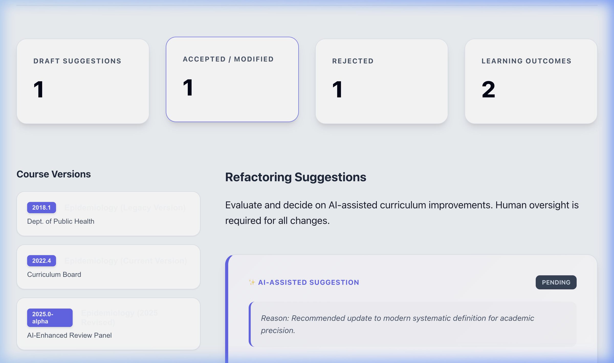

# AI-Assisted Curriculum Refactoring Tool

A local-first, governance-ready application for analyzing, harmonizing, and improving curriculum content through structured and AI-supported workflows.

## 🔗 Role in the CloudPedagogy Ecosystem

**Phase:** Phase 4 — Curriculum Extensions

**Role:**
Harmonizes and improves curriculum content by providing AI-supported suggestions and version comparison with a human-in-the-loop review layer.

**Upstream Inputs:**
Module Registry assets from the **Shared Module Repository System** and structural data from the **Mapping Engine**.

**Downstream Outputs:**
Provides refined curriculum drafts for validation in the **Curriculum Simulation Tool** and institutional **Governance Dashboard**.

**Does NOT:**
- Manage institutional governance workflows or systemic risk audits.
- Perform detailed workload or student strain simulation.

This tool is designed to support academic lead reviews, identifying content gaps, identifying similarities, and providing actionable, human-verified refactoring suggestions across multiple curriculum versions.

🌐 **Live Hosted Version**  
[http://cloudpedagogy-ai-assisted-curriculum-refactoring-tool.s3-website.eu-west-2.amazonaws.com/](http://cloudpedagogy-ai-assisted-curriculum-refactoring-tool.s3-website.eu-west-2.amazonaws.com/)

🖼️ **Screenshot**  

---

## 🚀 Key Features

- **Multi-Version Comparison**: Side-by-side diffing of curriculum documents with semantic status tags (Added, Modified, Removed).
- **AI Governance Layer**: Explicit AI labeling, rationales, and human-in-the-loop decision controls (Accept, Modify, Reject).
- **Local-First Privacy**: All processing and refactoring decisions are stored on your local machine.
- **Accessibility Optimized**: High-contrast, WCAG-aligned UI for clear curriculum review.

## 📖 Getting Started

For detailed installation and usage instructions, please refer to:  
👉 **[INSTRUCTIONS.md](INSTRUCTIONS.md)**

---

🛡️ **Disclaimer**  
This repository contains exploratory, framework-aligned tools developed for reflection, learning, and discussion.

These tools are provided as-is and are not production systems, audits, or compliance instruments. Outputs are indicative only and should be interpreted in context using professional judgement.

All applications are designed to run locally in the browser. No user data is collected, stored, or transmitted.

All example data and structures are synthetic and do not represent any real institution, programme, or curriculum.

📜 **Licensing & Scope**  
This repository contains open-source software released under the MIT License.

CloudPedagogy frameworks and related materials are licensed separately and are not embedded or enforced within this software.

☁️ **About CloudPedagogy**  
CloudPedagogy develops open, governance-credible resources for building confident, responsible AI capability across education, research, and public service.

**Website**: [https://www.cloudpedagogy.com/](https://www.cloudpedagogy.com/)  
**Framework**: CloudPedagogy AI Capability Framework

---

**Remote Repository**:  
[https://github.com/cloudpedagogy/cloudpedagogy-ai-assisted-curriculum-refactoring-tool.git](https://github.com/cloudpedagogy/cloudpedagogy-ai-assisted-curriculum-refactoring-tool.git)

## Capability and Governance

This tool supports both AI capability development and lightweight governance.

- Capability is developed through structured interaction with real workflows
- Governance is supported through optional fields that make assumptions, risks, and decisions visible

All governance inputs are optional and designed to support — not constrain — professional judgement.
